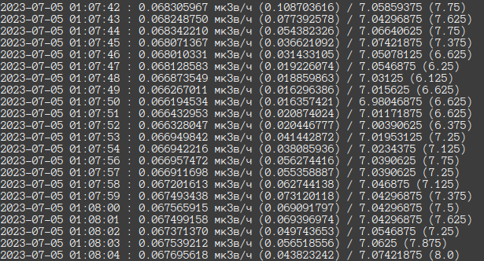

# rcm-101
RadioCode Monitor

REQUIREMENTS
------------

1. Linux
1. Bluez (`apt install bluez bluez-tools`, for example)
1. Latest Otus Lisp ([make; make install](https://github.com/yuriy-chumak/ol#build--install))
1. Sudo

RUNNING
-------

1. Run `hcitool lescan`, find your RadioCode-101 MAC
   1. if you see errors, try `hciconfig hci0 down` + `hciconfig hci0 up`.
   1. sometimes it's good to `killall -9 gatttool`.
1. Run `ol looper.lisp MAC`
1. You should have something like this:  
     

